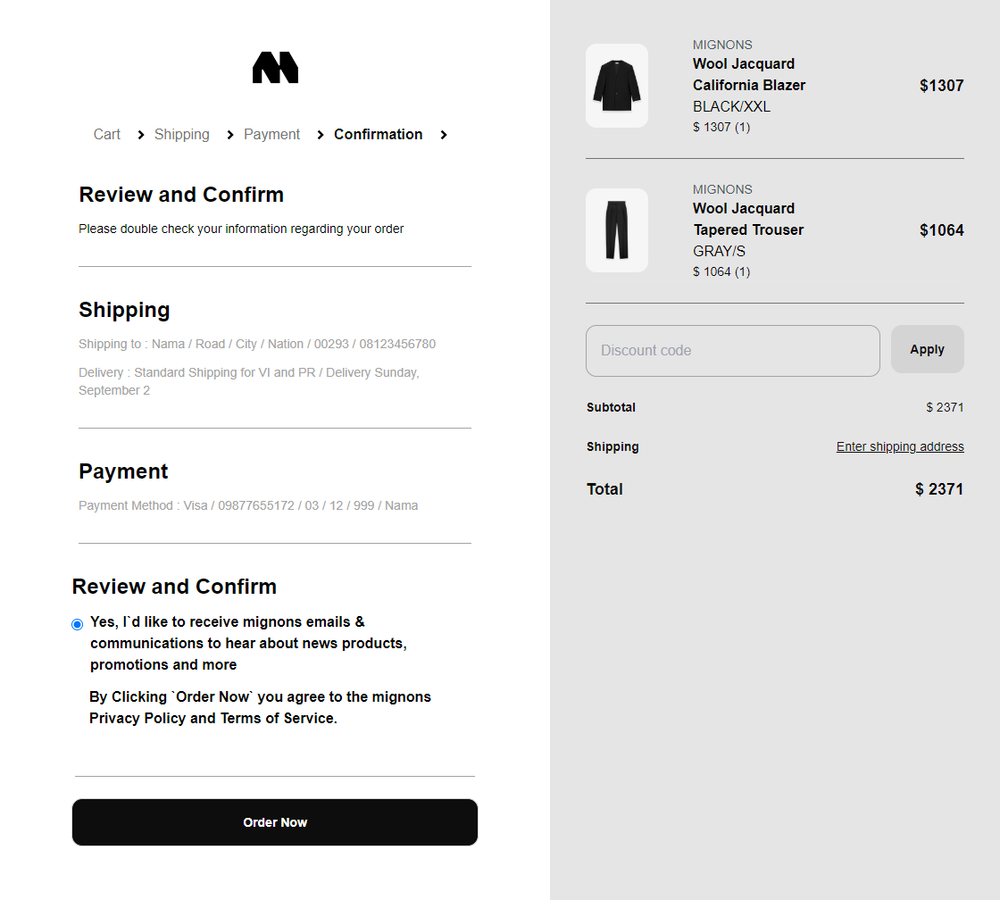

<h2>About the project</h2>

Welcome to Mignon's Streetwear, a cutting-edge e-commerce site crafted with React and Tailwind CSS. Our platform boasts a sleek, modern design and intuitive navigation, ensuring a seamless shopping experience. Browse our curated selection of streetwear, where the focus is always on the products you love. Enjoy the simplicity and elegance of our user-friendly interface, making it easier than ever to find and purchase your favorite styles.

Credits for the design goes to <a href='https://fearofgod.com/'>Fear Of God</a>

👉 Live Demo: <a href='https://mignons-streetwear.vercel.app/'>Mignons Website Demo</a>

<h3>Build with:</h3>

-   ![TailwindCSS][tailwindcss-badge]
-   ![ReactJs][react-badge]
-   ![Redux][redux-badge]
-   ![reactrouter][reactrouter-badge]

[tailwindcss-badge]: https://img.shields.io/badge/TailwindCSS-38B2AC?style=for-the-badge&logo=tailwind-css&logoColor=white

[react-badge]:https://img.shields.io/badge/-ReactJs-61DAFB?logo=react&logoColor=white&style=for-the-badge

[redux-badge]:https://img.shields.io/badge/-Redux-764ABC?style=flat&logo=redux&logoColor=white

[reactrouter-badge]:https://img.shields.io/badge/reactrouter-CA4245?style=for-the-badge&logo=reactrouter&logoColor=black
<h2>Screenshots of the Project 📸</h2>
 
<h3 align='center'>Home Page 🏡</h3>

  
<h3 align='center'>Categories Page 👇</h3>

 
 
<h3 align='center'>Login Page 💻</h3>

 
 
<h3 align='center'>Product Page 🎁</h3>

 
 
<h3 align='center'>Shopping Cart 🛒</h3>

 
 
<h3 align='center'>Payment Page 💻</h3>

 
 
<h3 align='center'>Confirmation Page 💻</h3>

